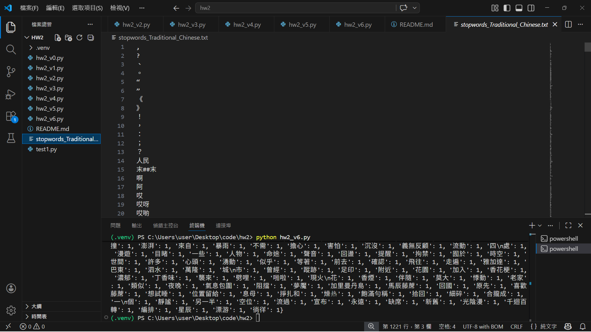
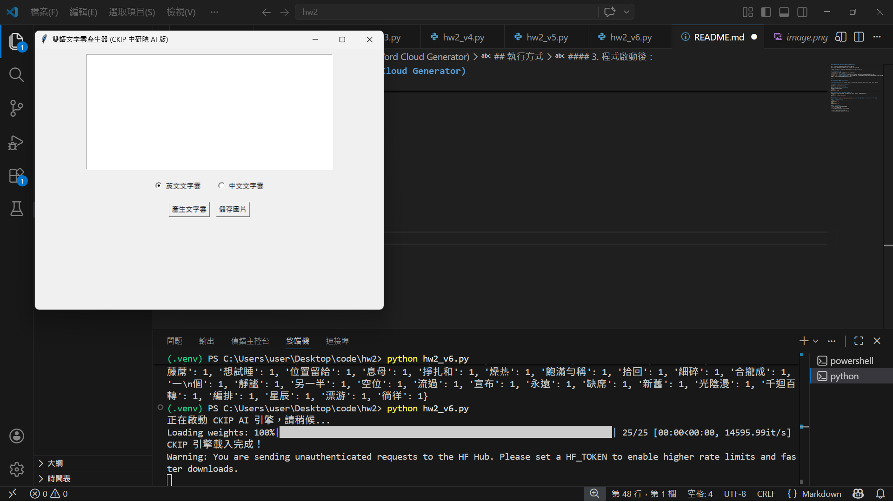
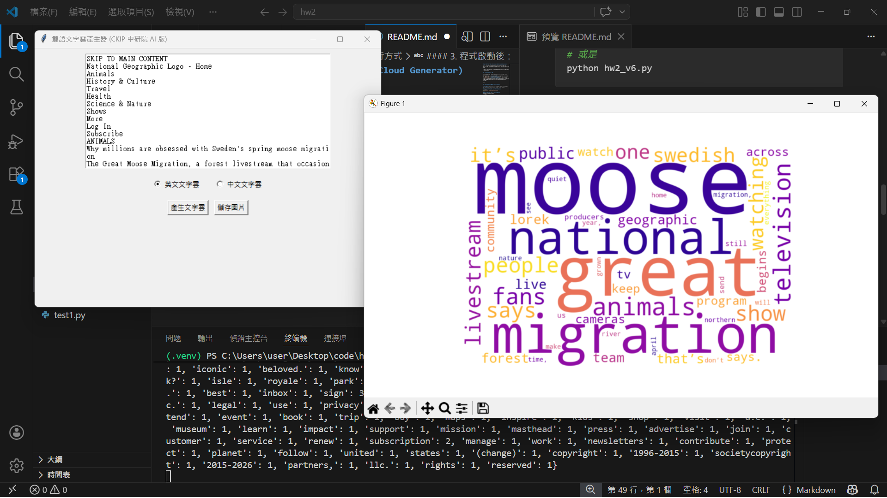
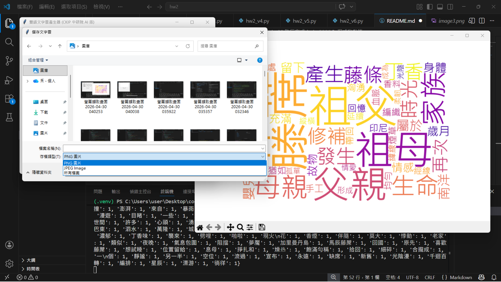
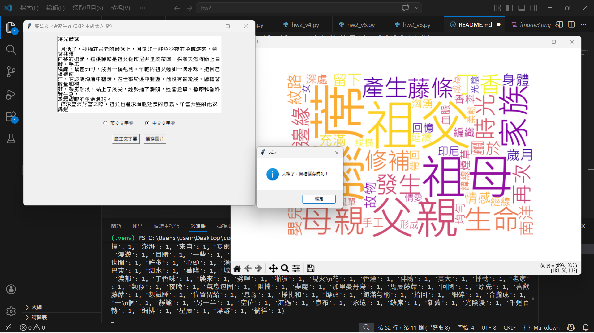
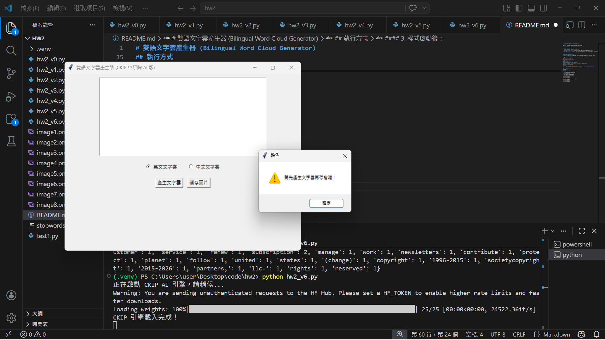

# 雙語文字雲產生器 (Bilingual Word Cloud Generator)

這是一個具備圖形化介面（GUI）的雙語文字雲產生器。
採用「物件導向」架構開發，運用 Hash 字典技巧優化詞頻計算，並使用外部的停用詞 `stopwords_Traditional_Chinese.txt` 來篩選中文停用詞。

為了展現不同的自然語言處理（NLP）技術，提供兩個版本的執行檔供測試：

## 檔案說明與版本差異

| 檔案名稱 | 斷詞核心 | 特色與優點 | 執行注意事項 |
| :--- | :--- | :--- | :--- |
| `hw2_v5.py` | **jieba (結巴)** | 套件體積小，載入與執行速度極快，適合輕量的文字分析。 | 無 |
| `hw2_v6.py` | **CKIP Transformers** | 採用中研院開發的 AI 深度學習模型，繁體中文斷詞準確度高。 | 初次按下產生按鈕時，需等待 AI 模型載入記憶體（終端機會有提示）。 |

---

## 環境建置與安裝指令 (Installation)

**溫馨提示**：在執行本程式前，請開啟終端機 (Terminal) 並根據您欲測試的版本，安裝對應的 Python 套件。

### 1. 共同必備套件 (兩個版本皆需安裝)
```bash
pip install wordcloud matplotlib
```
### 2. 若要測試 hw2_v5.py (jieba 版)
請額外安裝結巴斷詞套件：
```bash
pip install jieba
```
### 3. 若要測試 hw2_v6.py (CKIP 中研院 AI 版)
請額外安裝中研院的 CKIP 套件 (安裝時會自動一併下載 PyTorch 等深度學習套件)：
```bash
pip install -U ckip-transformers
```
## 執行方式
#### 1. 請確保 `stopwords_Traditional_Chinese.txt` (停用詞表) 與 Python 程式碼放在同一個資料夾下。


#### 2. 於終端機執行程式：
```bash
python hw2_v5.py
# 或是
python hw2_v6.py
```
#### 3. 程式啟動後：
* 勾選「英文文字雲」或「中文文字雲」。


* 在彈出的視窗中貼上欲分析的文章。
* 點擊「產生文字雲」即可預覽結果。




* 點擊「儲存圖片」可將結果輸出為圖檔。




* 如果沒有先產生文字雲就點擊「儲存圖片」，會跳出警告
